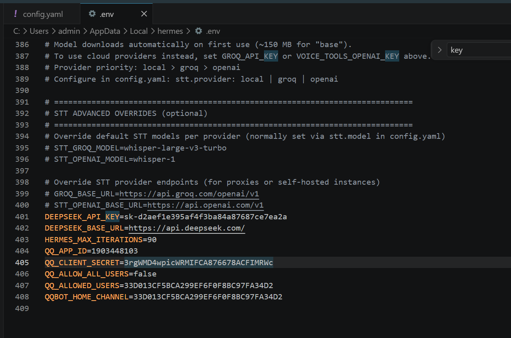

 API call failed (attempt 1/3): AuthenticationError [HTTP 401]
   🔌 Provider: deepseek  Model: deepseek-chat
   🌐 Endpoint: https://api.deepseek.com
   📝 Error: HTTP 401: Authentication Fails, Your api key: ****7d09 is invalid
   📋 Details: {'message': 'Authentication Fails, Your api key: ****7d09 is invalid', 'type': 'authentication_error', 'param': None, 'code': 'invalid_request_error'}
⚠️ Non-retryable error (HTTP 401) — trying fallback...
❌ Non-retryable error (HTTP 401): HTTP 401: Authentication Fails, Your api key: ****7d09 is invalid
❌ Non-retryable client error (HTTP 401). Aborting.
   🔌 Provider: deepseek  Model: deepseek-chat
   🌐 Endpoint: https://api.deepseek.com
   💡 Your API key was rejected by the provider. Check:
      • Is the key valid? Run: hermes setup
      • Does your account have access to deepseek-chat?

本次问题出现原因为，APIkey无效，导致调用失败，需要编辑C:\Users\admin\AppData\Local\hermes\.env文件，修改DEEPSEEK_API_KEY为正确的APIkey

排查思路，验证base_url是否正确
如base_url正确，但依旧返回400，则需要调整思路，确认是否是其它问题导致
如遇问题可参考以下配置文件
C:\Users\admin\AppData\Local\hermes
├── config.yaml     # 配置项（模型、终端、TTS、压缩等）
├── .env            # API 密钥与敏感信息
├── auth.json       # OAuth 提供商凭证（Nous Portal 等）
├── SOUL.md         # 主 Agent 身份（系统提示中的第 1 槽位）
├── memories/       # 持久记忆（MEMORY.md、USER.md）
├── skills/         # Agent 创建的技能（由 skill_manage 工具管理）
├── cron/           # 定时任务
├── sessions/       # 网关会话
└── logs/           # 日志（errors.log、gateway.log——自动脱敏）